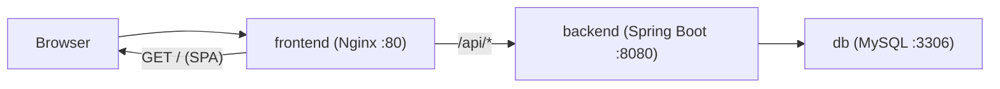
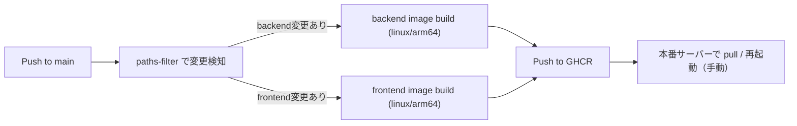
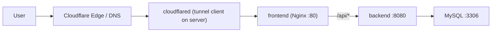

# Glimpse

個人 Wiki / ブログプロジェクト（React + Spring Boot + MySQL）

---

## プロジェクト概要

Glimpse は「閲覧は誰でも、管理は ADMIN のみ」を基本にしたシンプルなブログ基盤です。  
ローカル開発は Docker Compose を前提に、`frontend`（Nginx 同梱）・`backend`・`db` の 3 サービスで動かします。

---

## 技術スタック

- フロントエンド: React + TypeScript + Vite
- Web サーバー: Nginx（SPA 配信 + `/api` のリバースプロキシ）
- バックエンド: Spring Boot 3.5 (Java 21)
- DB: MySQL 8.0
- コンテナ: Docker / Docker Compose
- CI/CD: GitHub Actions + GHCR

---

## 全体構成（ローカル / 本番の基本形）



- ブラウザは `frontend` コンテナにアクセス
- Nginx が静的ファイルを返し、`/api/*` を `backend:8080` に中継
- バックエンドは MySQL に接続

---

## ローカル開発構成（Docker Compose 前提）

対象ファイル: `docker-compose.dev.yml`

### 起動

```bash
docker compose -f docker-compose.dev.yml up -d --build
```

### 停止

```bash
docker compose -f docker-compose.dev.yml down
```

### よく使う確認コマンド

```bash
docker compose -f docker-compose.dev.yml ps
docker compose -f docker-compose.dev.yml logs -f backend
docker compose -f docker-compose.dev.yml logs -f frontend
```

### ローカル接続先

- フロントエンド: `http://localhost`（host `80 -> container 80`）
- バックエンド API: `http://localhost:8080`
- MySQL: `localhost:3308`（host `3308 -> container 3306`）

### 環境変数（`.env`）

`docker-compose.dev.yml` では主に以下を利用します。

- MySQL: `MYSQL_DATABASE`, `MYSQL_USER`, `MYSQL_PASSWORD`, `MYSQL_ROOT_PASSWORD`
- Backend DB 接続: `SPRING_DATASOURCE_URL`, `SPRING_DATASOURCE_USERNAME`, `SPRING_DATASOURCE_PASSWORD`
- 初期管理者: `APP_ADMIN_USERNAME`, `APP_ADMIN_PASSWORD`
- JWT: `JWT_SECRET`, `JWT_EXPIRATION_MS`

補足: フロントをコンテナではなく手元で起動する場合は、`frontend` ディレクトリで `npm run dev`（既定 `:3001`）を使用します。Vite の `/api` プロキシ先は `http://localhost:8080` です。

---

## CI/CD フロー（GitHub Actions / GHCR / デプロイ）

対象ファイル: `.github/workflows/publish.yml`



- `main` ブランチへの push でワークフロー起動
- `dorny/paths-filter` で `backend/**` / `frontend/**` の変更を判定
- 変更があるサービスのみ Docker イメージを build & push
- レジストリは GHCR（`ghcr.io/haru-0035-git/...`）
- タグは `latest` と `commit SHA` の 2 系統
- 現在の workflow には「本番反映（サーバーへ自動デプロイ）」は含まれておらず、GHCR へ push 後に本番側で `docker compose pull` + 再起動を行う運用

---

## 本番環境の概要

### 基本

- コンテナ構成自体はローカルと同じ（`frontend` / `backend` / `db`）
- 公開エントリは Nginx（`frontend`）を起点にし、API は内部で `backend` へ中継
- シークレット（JWT・DB パスワード等）は `.env` をそのままコミットせず、環境ごとに安全に注入

### Cloudflare Tunnel を使う場合（任意）

Cloudflare Tunnel を使う場合の典型フローは以下です。



- 公開トラフィックは Cloudflare 側で受け、Tunnel 経由でサーバー内の Nginx に到達
- TLS 終端を Cloudflare 側で持たせる運用にしやすい
- 必要に応じて Cloudflare Access を併用し、`/admin` や管理系導線の追加保護を行う

---

## ユーザーの役割（ロール）

- **GUEST（ゲスト）**: ログインしていない、サイトを訪れたすべての人
- **ADMIN（管理者）**: あなた自身。すべての権限を持つ
- **(将来的に) USER（投稿者）**: サインインした一般ユーザー。自分の記事のみ投稿・編集できる（※最初のバージョンでは不要）

---

## 機能リスト（ブログ版）

### 閲覧者向け機能（誰でもアクセス可能）

- [ ] 記事の一覧表示（トップページに新着記事がリスト表示される）
- [ ] 記事の詳細表示（タイトル、本文、投稿日、著者など）
- [ ] カテゴリ機能（カテゴリ別に記事を絞り込んで一覧表示）
- [ ] タグ機能（タグで関連記事を探せる）
- [ ] 検索機能（キーワードで記事を検索）

### 管理者向け機能（ログイン後）

- [ ] 認証機能（ログイン・ログアウト）
- [ ] ダッシュボード（記事の管理画面トップ）
- [ ] 記事の作成 (CRUD)
- [ ] 記事の更新・削除 (CRUD)
- [ ] (Nice-to-have) 画像アップロード機能（記事に画像を簡単に挿入）

---

## 技術的なポイント

### セキュリティの強化

- **認証と認可 (JWT & RBAC)**:
  - `/api/authenticate` でログインし JWT を発行
  - `Authorization: Bearer <token>` ヘッダーで API 認可
  - Spring Security で管理者権限を制御
- **パスワードの保護**: BCrypt でハッシュ化
- **XSS 対策**: 入力値サニタイズを必須化

### SEO（検索エンジン最適化）

- React SPA のため、`<title>` / `<meta>` の適切な設定を優先

---

## 開発計画（MVP の再定義）

まずはコア機能に絞った MVP（Minimum Viable Product）を完成させることを目指します。

### 新しい MVP 案

- **役割**: 投稿者はあなただけ（ADMIN ロールのみ）。一般ユーザーのサインイン機能は後回し

#### 管理者機能

- ログイン機能
- 記事の作成・更新・削除・一覧表示

#### 閲覧者機能

- 誰でも見られる記事の一覧表示
- 誰でも見られる記事の詳細表示
